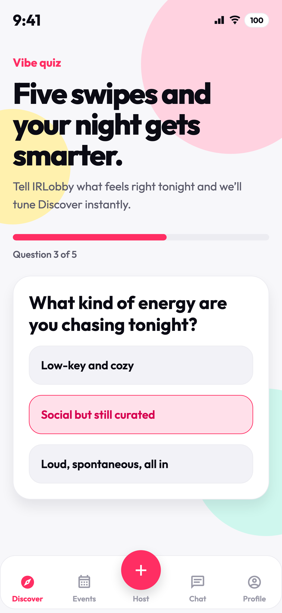
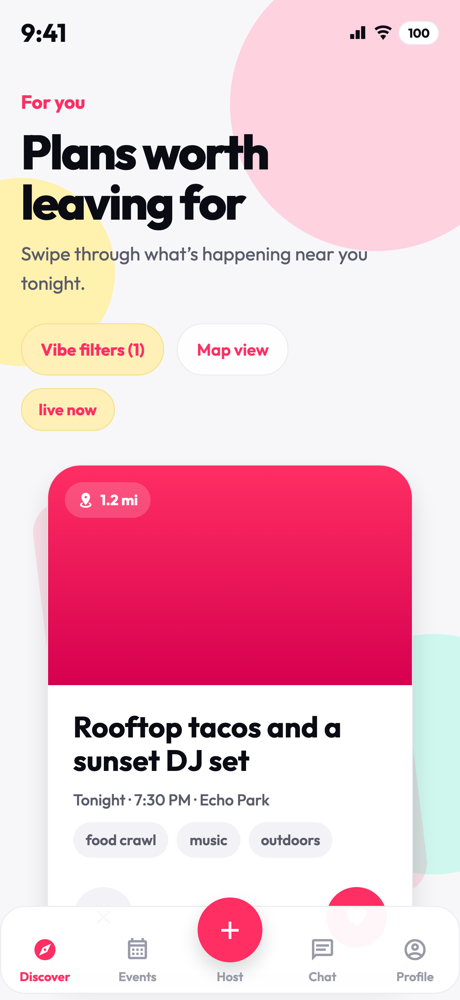
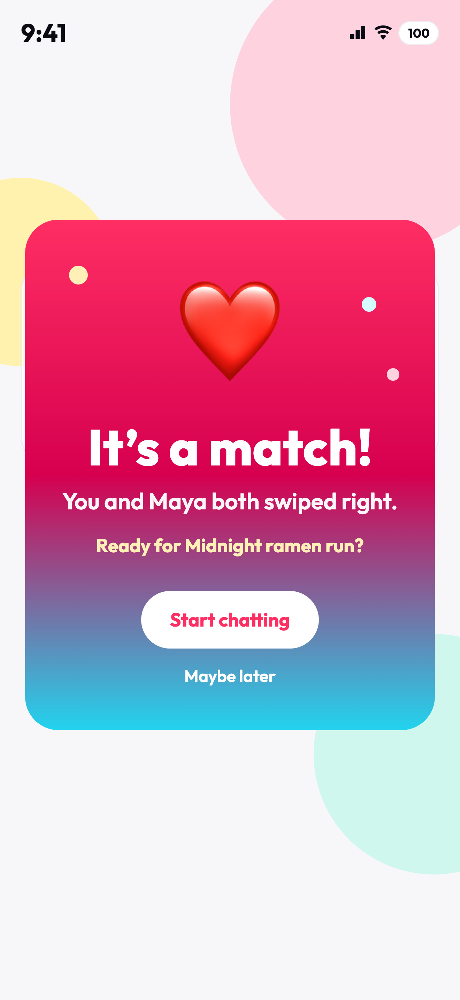
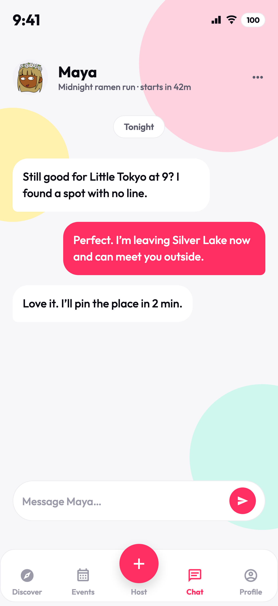
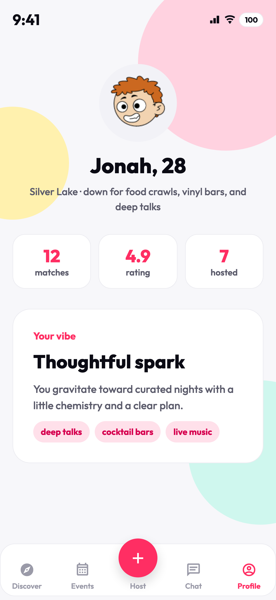
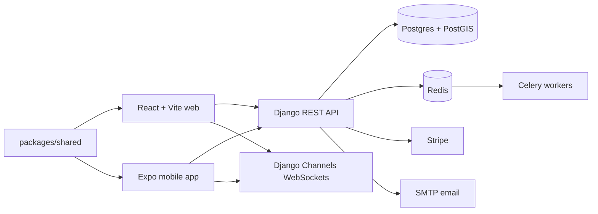

# IRLobby

[](https://github.com/ajesbenshade/IRLobby/actions/workflows/ci.yml)
[](https://github.com/ajesbenshade/IRLobby/actions/workflows/release-gate.yml)

[](https://github.com/ajesbenshade/IRLobby/actions/workflows/mobile-eas-build.yml)


IRLobby is an activity-first social matching application. Users swipe on nearby activities. When two users select the same activity, the application creates a match and opens a chat that includes the activity context.

[Live app](https://irlobby.com) | [Download](https://irlobby.com/download) | [Quick start](#quick-start) | [License](LICENSE)

<p align="center">
	
	
	
	
	
</p>

## Product purpose

Many swipe applications start with user profiles. IRLobby starts with the plan: activity, time, place, and energy. When two users want the same real-world activity, the application creates a focused match and conversation.

## Features

- Activity-first discovery with swipeable cards for nearby plans
- Vibe quiz personalization for the activity feed
- Match-to-chat flow that keeps activity context in the conversation
- Web and mobile clients that share API assumptions and release checks
- Safety and privacy surfaces: account deletion, blocking, reporting, and moderation
- Stripe-ready ticketing and QR redemption for paid activities
- Django backend with REST APIs, WebSockets, Celery, Redis, Postgres/PostGIS, and release gates

## Tech stack

| Area         | Stack                                                            |
| ------------ | ---------------------------------------------------------------- |
| Mobile       | Expo 54, React Native 0.81, React 19, NativeWind                 |
| Web          | React 18, Vite, TypeScript, Tailwind CSS                         |
| Backend      | Django 4.2 LTS, Django REST Framework, Channels, Celery          |
| Data         | PostgreSQL/PostGIS in production, SQLite-friendly local defaults |
| Integrations | Stripe, Expo push notifications, Sentry, SMTP, Twitter OAuth     |
| Tooling      | GitHub Actions, EAS Build, Jest, pytest, ruff, black, mypy       |

## Architecture



## Repository layout

These packages are active and supported:

- `apps/mobile` — React Native / Expo mobile app
- `apps/web` — React + Vite public site and authenticated app shell
- `irlobby_backend` — Django REST, WebSocket, Celery, and deployment code
- `packages/shared` — shared schema and utility code
- `docs` — release, parity, deployment, email, and brand documentation
- `site` — static marketing and App Store legal pages (`/privacy`, `/support`) served from the Hetzner nginx stack

## Quick start

### Prerequisites

- Node.js 20.x
- Python 3.12 for local development and CI
- Python 3.11.9 for production deploys
- Git

### Install JavaScript workspaces

```bash
npm install
```

### Run the backend

```bash
cd irlobby_backend
python -m venv .venv
source .venv/bin/activate
pip install -r requirements.txt
cp ../.env.example .env
python manage.py migrate
python manage.py runserver
```

The API is available at `http://localhost:8000`.

### Run the web app

```bash
npm run dev:web
```

### Run the mobile app

```bash
npm run dev:mobile
```

Follow the Expo CLI instructions to open the app in a simulator or on a device.

## Development checks

- `npm run check:api-contract` — validates frontend API path usage against Django routes
- `npm run check:web` — runs web lint, format check, tests, and production build
- `npm run check:mobile` — runs mobile typecheck and iOS bundle export
- `npm run check:release` — runs the full frontend and mobile release gate

Backend checks run from `irlobby_backend`:

```bash
python manage.py check
pytest
```

## Release and deployment

- [Deployment overview](docs/DEPLOYMENT.md) — production environment variables, Redis hardening, health checks, and hosting notes
- [Oracle backend runbook](irlobby_backend/deploy/oracle/README.md) — Docker Compose backend deployment
- [App Store release](apps/mobile/APP_STORE_RELEASE.md), [launch checklist](LAUNCH_CHECKLIST.md), and [Play Store launch](PLAY_STORE_LAUNCH.md) — mobile release flow
- [Repository settings checklist](docs/REPOSITORY_SETTINGS.md) — GitHub description, website, topics, and social preview recommendations

## Contributing

IRLobby is a closed-source project. The project does not accept public pull requests. For authorized contribution arrangements, see [CONTRIBUTING.md](CONTRIBUTING.md).

## License

IRLobby is proprietary software. All rights reserved. See [LICENSE](LICENSE).
